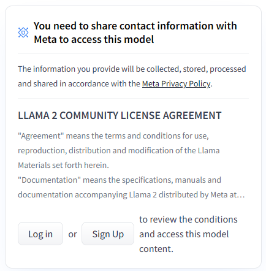

<!-- Check whether the assignment is ready to release -->
{{'now' | date: '%s'}}
{{page.release_date | date: '%s'}}
 

Warning: this assignment is out of date.  It may still need to be updated for this year's class.  Check with your instructor before you start working on this assignment.


<!-- End of check whether the assignment is up to date -->

<!-- Check whether the assignment is up to date -->
{{'now' | date: '%Y'}}
{{page.due_date | date: '%Y'}}
 

Warning: this assignment is out of date.  It may still need to be updated for this year's class.  Check with your instructor before you start working on this assignment.


<!-- End of check whether the assignment is up to date -->

This assignment is due on {{ page.due_date | date: "%A, %B %-d, %Y" }} before {{ page.due_date | date: "%I:%M%p" }}. 



You can download the materials for this assignment here:
<ul>

<li><a href="{{item.url}}">{{ item.name }}</a></li>

</ul>



{{page.type}} {{page.number}}: {{page.title}}
=============================================================

Now that you know how to prompt an LLM from HW2, we will be using some guided story generation techniques from Module 2.
In this homework, you will be following a generation pipeline inspired by the [Plan-and-Write system](https://ojs.aaai.org/index.php/AAAI/article/view/4726). In their work, they generated keywords from a title and then generated a story from the keywords. They tried both dynamic and static schemas to integrate the planning into their generation pipeline. This homework will focus on the "static" schema but use a pre-trained LLM instead of their RNN model.

## Learning Objectives
For this assignment, we will check your ability to:
* Prompt an LLM to generate stories given varying amounts of context
* Implement NLP evaluation metrics using existing libraries
* Compare the quality of guided vs unguided story generation
* Determine the adequacy of automated metrics like BLEU and ROGUE for creative evaluation

## What to do
### Getting Started
Like in the last homework, you will be using a [Jupyter notebook]({{ site.baseurl }}/homeworks/plan-and-write/hw3.ipynb), but instead of using OpenAI's suite of models, we're going to use Meta's Llama 2 via HuggingFace🤗. Again, you can run in your VS Code environment or upload it to [Google Colab](https://colab.research.google.com/) or [DeepNote](https://deepnote.com/) to do the assignment online.

Important: You will need to get access to Llama-2 before running it! Once you log into your Hugging Face account, you will need to fill out the license agreement.
 

You will be using a portion of the data from the original Plan-and-Write work. I have already setup the data in [the notebook]({{ site.baseurl }}/homeworks/plan-and-write/hw3.ipynb). You will be using the stories, their titles, and the keywords they extracted. And you will only be looking at 20 stories from the dataset.

### 1) Generating new stories

In the notebook, you are given a series of functions that will retrieve the story data for you.
* `load_data` will return a list of all of the data in the file.
* `get_story` will return a list of the sentences in the story.
* `get_title` will return the title of a story from a given line.
* `get_keywords` will return the keywords of a story from a given line.

I have taken 20 stories from the original dataset for you to work with.

You will be generating stories for all 20 prompts in two ways (40 generated stories in total):
* Unconditioned: Given a title, generate a 5-sentence story
* Conditioned: Given a title and keywords, generate a 5-sentence story where each keyword corresponds to a sentence in the story -- this will be similar to the method in the paper

You are welcome to use any prompting techniques (e.g., zero-shot, few-shot, chain-of-thought). Like in HW2, it will be beneficial for you try multiple prompts until you get the best results, even if it's just changing the wording of the prompt. However, you are only required to show your final prompt for both conditioned and unconditioned generation.

Note: If you are using few-shot prompting, use a story from outside of the 20 stories I gave you to evaluate on. I get the 20 examples from <code class="language-plaintext highlighter-rouge">reader</code> in the <code class="language-plaintext highlighter-rouge">load_data()</code> function. You can use a story from any other index outside of <code class="language-plaintext highlighter-rouge">[1:21]</code> for your prompts.

### 2) Evaluate stories

You will evaluate the stories in a few different ways:
a) BLEU - precision using n-grams
b) ROUGE - recall of n-grams

N-grams are a common unit in NLP for talking about words that appear next to each other, where the `n` denotes how many words. For example, the sentence "The dog was really happy" contains:
* The unigrams `The`, `dog`, `was`, `really`, and `happy`
* The bigrams `The dog`, `dog was`, `was really`, and `really happy`
* The trigrams `The dog was`, `dog was really`, and `was really happy`
* etc.

BLEU and ROUGE are common evaluation metrics used in NLP. [BLEU](https://aclanthology.org/P02-1040/) was created to evaluate how accurate machine translation (computational translation of one human language to another) systems were.
[ROUGE](https://aclanthology.org/W04-1013/) was created to evaluate generated summaries of text.

You will implement BLEU and ROUGE using the following libraries:
* BLEU - [https://www.nltk.org/api/nltk.translate.bleu_score.html](https://www.nltk.org/api/nltk.translate.bleu_score.html)
* ROUGE - [https://pypi.org/project/rouge-score/](https://pypi.org/project/rouge-score/)

And you should calculate BLEU-1, BLEU-2, ROUGE-1, ROUGE-2, and ROUGE-L comparing both the controlled generation vs original story and uncontrolled generation vs original story. Specificially, the BLEU will be modified n-gram precision. Calculate these scores over each pair of sentences in the data and then average across the 20 stories. You will be implementing the BLEU and ROGUE functions to compare the sentences one-by-one in the stories and return an average across the 5 sentences.

Important: The output from the decoder will be stored in <code class="language-plaintext highlighter-rouge">uncontrolled_stories</code> and <code class="language-plaintext highlighter-rouge">controlled_stories</code>. Before running these generated stories through BLEU/ROUGE, you will need to cut off the prompt since it will return the entire string with your prompt + the generated story after that.

Keep adjusting the prompt until you can consistently generate 5-sentence stories, but if you've tried a bunch of things and are still unable to get it to produce 5 sentences, evaluate on whatever sentences it generates. You can "pad" the story with empty strings to compare against with BLEU/ROUGE.

### 3) Analysis
Please answer the following questions in a separate document and save it as a pdf. Each answer should be a few sentences long.

1. Simply reading the generated stories: 
	* a) What is the quality of the stories overall? (2 pts)
	* b) How do the compare across the conditions? (2 pts)
	* c) Which of the two conditions produced better stories? Why? (2 pts)
2. What prompting techniques did you find work the best? (2 pts)
3. Did the prompt need to be significantly altered to work well with the different inputs? Why? (2 pts)
4. Higher BLEU and ROUGE scores mean better matches. Were there any interesting patterns that you can see with the BLEU and ROUGE scores? (2 pts)
5. Did the BLEU/ROUGE correlate with your subjective analysis (just reading)? Why or why not? (2 pts)
6. Are BLEU/ROUGE sufficient metrics for evaluating these stories? Why or why not? (2 pts)

## What to submit

You should submit
* your completed Jupyter Notebook, and 
* a pdf of your answers to the questions in part 3 (analysis)
to [Blackboard]({{page.submission_link}}).  You can work in pairs.

# Grading

 * Generate stories using only titles (5 pts)
 * Generate stories using titles and keywords (5 pts)
 * Write functions for BLEU and ROUGE (4 pts)
 * Analysis (16 pts)
 

 
 
# Recommended readings

<table>
   
    <tr>
      <td>
	
		<a href="{{ publication.url }}">{{ publication.title }}</a>
        
		{{ publication.title }}
	
		      
		- {{ publication.authors }}.
	
		
		{{ publication.venue }}  {{ publication.year }}.
	

	
	<!-- abstract button -->
	<a data-toggle="modal" href="#{{publication.id}}-abstract" class="label label-success">Abstract</a>
	<!-- /.abstract button -->
	<!-- abstract content -->
	

    

      

        

          <button type="button" class="close" data-dismiss="modal" aria-label="Close">&times;</button>
          <h4 class="modal-title" id="{{publication.id}}">{{publication.title}}</h4>
        
<!-- /.modal-header -->
        

        {{publication.abstract}}
        
<!-- /.modal-body -->
	
<!-- /.modal-content -->
	
<!-- /.modal-dialog -->
	
<!-- /.abstract-content -->
	
	
	<!-- bibtex button -->
	<a data-toggle="modal" href="#{{publication.id}}-bibtex" class="label label-default">BibTex</a>
	<!-- /.bibtex button -->
	<!-- bibtex content -->
	

    

      

        

          <button type="button" class="close" data-dismiss="modal" aria-label="Close">&times;</button>
          <h4 class="modal-title" id="{{publication.id}}">{{publication.title}}</h4>
        
<!-- /.modal-header -->
        

 	   <pre>{{publication.bibtex}}
           </pre>
        
<!-- /.modal-body -->
	
<!-- /.modal-content -->
	
<!-- /.modal-dialog -->
	
<!-- /.bibtex-content -->
	
</td></tr>
  
</table>
