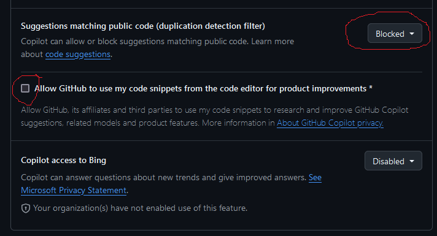
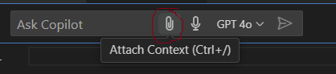

<!-- Check whether the assignment is ready to release -->
{{site.time | date: '%Y%m%d'}}
{{page.due_date | date: '%Y%m%d'}}
 
<div class="alert alert-danger">

Warning: this assignment is out of date.  It may still need to be updated for this year's class.  Check with your instructor before you start working on this assignment.
</div>

<!-- End of check whether the assignment is up to date -->


<!-- Check whether the assignment is up to date -->
{{'now' | date: '%Y'}}
{{page.due_date | date: '%Y'}}
 
<div class="alert alert-danger">
Warning: this assignment is out of date.  It may still need to be updated for this year's class.  Check with your instructor before you start working on this assignment.
</div>

<!-- End of check whether the assignment is up to date -->


<div class="alert alert-info">
This assignment is due on {{ page.due_date | date: "%A, %B %-d, %Y" }} at {{ page.due_date | date: "%I:%M%p" }} EST. 
</div>


<div class="alert alert-info">
You can download the materials for this assignment here:
<ul>

<li><a href="{{item.url}}">{{ item.name }}</a></li>

</ul>
</div>



{{page.type}} {{page.number}}: {{page.title}}
=============================================================
## Learning Objectives
* Figure out how to write a problem for a planning program.
* Determine how utility functions within Sabre.
* Compare and contrast the planner's behavior to when the game is played by a human.
Extra Credit:
* Generate a planning problem using a code-based LLM.
* Compare the processes of generating a planning problem by hand vs LLM

## Instructions
In this homework, we're going back to the beginning! 
Here's an overview of what you'll do:
1. Convert the Action Castle game from HW1 into [Sabre](http://cs.uky.edu/~sgware/projects/sabre/)'s syntax by hand.
2. Convert a WikiHow article into a Sabre problem using Github Copilot.
3. Analysis!


## Working with Sabre
In this first part, you will be creating a planning problem following the syntax of Sabre and then running your problem through the Sabre planner.

[Sabre](http://cs.uky.edu/~sgware/projects/sabre/) tries to find a story based on a set of limits.
It has three different types of limits:
* **author temporal limit**: "maximum number of actions in the author’s plan—that is, the actual actions that will be executed to raise the author’s utility" (`-atl` flag)
* **character temporal limit**: "maximum number of actions in a plan a character imagines when justifying an action" (`-ctl` flag)
* **epistemic limit**: "how deeply Sabre will search into a character’s theory of mind" (`-el` flag)
Whether a limit is reached is calculated by looking at the **utility** of the overall problem (`utility()`) or the utility of a particular character's perspective (e.g., `utility(Princess)`).

The above definitions and more information can be found in the report [A Collection of Benchmark Problems for the Sabre Narrative Planner](https://github.com/sgware/sabre-benchmarks/blob/main/report.pdf). You can also find a partial example of a problem that I made in [the Extra Credit](extra-credit-use-github-copilot-for-problem-creation).

### Part 1: Make a Planning Problem by Hand
The skeleton of a problem has been provided to you in [the notebook]({{page.materials[2].url}})

You might notice that there are some variations from Action Castle. I've simplified a few things: the rose is just in the garden (no rosebush) and there is no "Death" room or path from the tree.

To write a problem for Sabre, do the following:
1. Download one or a couple of the problems from the list [https://github.com/sgware/sabre-benchmarks/tree/main/problems](https://github.com/sgware/sabre-benchmarks/tree/main/problems) 
to use as reference.
2. Find your HW1 notebook. If you can't find your notebook from when you did HW1, here it is again: [Homework 1 Notebook]({{page.materials[1].url}})
3. Note the syntax used in the example Sabre problems to make a planning problem for the first Action Castle game. You will implement the following things from Action Castle in your plan:
  * How the locations are connected
	* This will be a mixture of properties and intial state predicates. Take a look at [Gramma](https://github.com/sgware/sabre-benchmarks/blob/main/problems/gramma.txt) for an example of how to do this.
  * Item & Scenery Item properties
	* Again, this will be properties and intial state predicates.
  * Actions (unlock door, read runes, propose, wear crown, sit on throne)
     * Hint: these already have pre-conditions and effects from HW 1
  * Blocks (troll, guard, darkness, door)
	* These will probably be a combination of properties, initial state predicates, effects of actions, and maybe even triggers.
4. Additionally, you will implement a few utilities. Namely, 2 for solving each block and 1 for picking up each inventory item except the lamp (since the Player starts with it).
5. Download the [notebook for running Sabre]({{page.materials[2].url}}) and test your file. You can also run one of the example files to see what a successful plan looks like.
6. Iterate until Sabre can solve your problem. **Tip: To debug your problem once your syntax bugs are fixed, you can try changing your utility to a smaller problem until you know the paths are available. For example, set your utility to `location(Player) == GardenPath` if you're trying to make sure your walk action works.**
Also, the deeper the goal is, the longer the planner is going to take to run.


### Part 2: Experiment with Utility
1. (2 pts) Set your `utility()` as the following block:
```
utility():
	if(crowned(Player))
		1
	else
		0;
```
	* Copy and paste the plan that you get (printed at the end of the output when you run the Java command) into a word document.
	* Does this plan differ a lot from the interactive fiction version of Action Castle? (1-3 sentences)
2. (2 pts) Give the characters their own utility that is consistent with their attributes/personality in the game. 
	* Copy and paste what your utilities are and what the resulting plan is into your word document.
3. (2 pts) Does adjusting the characters' utilities result in a more interesting story? If so, why? If not, why not? (2-3 sentences)
4. (2 pts) Traditional planners require a *pre-specified goal* that the system tries to find a path toward. How does Sabre compare to more traditional planners? (1-3 sentences)


## Extra Credit: Use GitHub Copilot for Problem Creation

### Setting up GitHub Copilot
You can find the instructions here: [https://code.visualstudio.com/docs/copilot/setup](https://code.visualstudio.com/docs/copilot/setup)

But it essentially is:
1. Get access to [GitHub Copilot](https://github.com/features/copilot), you can sign up for a [free student account](https://docs.github.com/en/education/explore-the-benefits-of-teaching-and-learning-with-github-education/github-education-for-students/apply-to-github-education-as-a-student) or do the 1-month free trial. It's usually $10/month.
2. Make sure to **block** suggestions matching public code and **uncheck** allowing GitHub to use your code snippets to train on.
 
3. Install the extension on VSCode & link it to your GitHub account.

And you should be ready to go!

### Generating a Planning Problem from wikiHow
We'll now use GitHub Copilot to write a Sabre problem for a wikiHow article.  The goal for this is to start from something that describes proceedures and actions and is written in natural language, and then have Copilot translate it into the description language used for automated planning.

Here are a few wikiHow articles that I thought might be interesting since they had some elements that could make for interesting interactive fiction.  It's fine to pick your own article.   **You shouldn't translate the whole article, just a few steps, so you can pick out the parts that you think are most relevant/easiest to create a schema from.**

Survival Stories
* [How to Survive in the Woods](https://www.wikihow.com/Survive-in-the-Woods)
* [How to Survive in the Jungle](https://www.wikihow.com/Survive-in-the-Jungle)
* [How to Survive on a Desert Island](https://www.wikihow.com/Survive-on-a-Desert-Island
) 
* [How to Survive on a Deserted Island With Nothing](https://www.wikihow.com/Survive-on-a-Deserted-Island-With-Nothing)
* [How to Get Out of Quicksand](https://www.wikihow.com/Get-Out-of-Quicksand)
* [How to Open a Coconut](https://www.wikihow.com/Open-a-Coconut)
* [How to Test if a Plant Is Edible](https://www.wikihow.com/Test-if-a-Plant-Is-Edible)
* [How to Find True North Without a Compass](https://www.wikihow.com/Find-True-North-Without-a-Compass)
* [How to Survive a Wolf Attack](https://www.wikihow.com/Survive-a-Wolf-Attack)

Detectives
* [How to Make a Detective Kit](https://www.wikihow.com/Make-a-Detective-Kit)
* [How to Disguise Yourself](https://www.wikihow.com/Disguise-Yourself)
* [How to Make a Hidden Camera](https://www.wikihow.com/Make-a-Hidden-Camera)
* [How to Hide Money](https://www.wikihow.com/Hide-Money)
* [How to Spy on People](https://www.wikihow.com/Spy-on-People)
* [How to Hack](https://www.wikihow.com/Hack)
* [How to Make a Grappling Hook](https://www.wikihow.com/Make-a-Grappling-Hook)
* [How to Open a Locked Door](https://www.wikihow.com/Open-a-Locked-Door)
* [How to Create a Secret Society](https://www.wikihow.com/Create-a-Secret-Society)

Dystopian Futures
* [How to Survive a Comet Hitting Earth](https://www.wikihow.com/Survive-a-Comet-Hitting-Earth)
* [How to Survive an EMP](https://www.wikihow.com/Survive-an-EMP)
* [How to Survive a Nuclear Attack](https://www.wikihow.com/Survive-a-Nuclear-Attack)
* [How to Build a Fallout Shelter](https://www.wikihow.com/Build-a-Fallout-Shelter)
* [How to Survive a Riot](https://www.wikihow.com/Survive-a-Riot)
* [How to Survive Under Martial Law](https://www.wikihow.com/Survive-Under-Martial-Law)
* [How to Avoid Danger During Civil Unrest](https://www.wikihow.com/Avoid-Danger-During-Civil-Unrest)
* [How to Thwart an Abduction Attempt](https://www.wikihow.com/Thwart-an-Abduction-Attempt)
* [How to Make Papyrus](https://www.wikihow.com/Make-Papyrus)


As an example, I'll pick the [How to Survive in the Woods](https://www.wikihow.com/Survive-in-the-Woods) article, and show you how part of the schema might look.  Here is step 1 from that article: 


<center>

</center>


> ### Finding Drinking Water
> Search for a source of fresh water.[1]  The first thing that you'll need in order to survive in the woods is water that you can drink. Look for signs of fresh water nearby like areas of green foliage that indicate water is nearby, low-lying areas where water could be collected, and signs of wildlife like animal tracks. It could mean that a creek, stream, or pond is nearby. While finding water is important for survival, be aware some water sources will not be safe - if possible treat all drinking water before using it. [2]
If there are mountains nearby, look for water collected at the foot of the cliffs.
> * The presence of insects like mosquitoes and flies means that water is nearby.
> * Water from heavily oxygenated water (such as from a big waterfall or rapids) typically is safer than that from a slow or still water source.
> * Freshwater springs are typically safer water sources, although these can be contaminated by mineral or bacteria as well.
> * Remember that all untreated water must be considered risky unless treated. Even crystal clear water can harbor diseases and be dangerous if consumed.

My Sabre problem for this might look like this:

I would declare some types that would be relevant. These are like listing variable.
```LISP
  type location;
  type type : attribute;
  type player : location;
  type attribute : entity;
  type water: entity;
  type status;
``` 
And some entities -- specific instances of the types above. These are like the characters and things in your story.
```LISP  
  entity Bugs : player;
  entity Treated : attribute;
  entity Fresh : type;
  entity Moving : type;
  entity Salt : type;
  entity Chesapeake : location;
  entity Lake : location;
  entity Water : water;
  entity Player : player;
```
And properties -- what types of what attributes entities might have and the relations they have with each other.
```LISP
  property is(location : location, attribute : attribute) : boolean;
  property has_water(location : location) : boolean;
  property is(location : location) : type;
  property at(player : player) : location;
  property from(water : water) : location;
  property safe(water : water) : boolean;
  property has(player : player, water : water) : boolean;
  ...
```

Then we need some starting facts -- what state things are in at the beginning of the story.
```LISP
  at(Foot) = Lake;
  at(Bugs)= Lake;
  !has(Player, Water);
  at(Player) = Chesapeake;
  has_water(Chesapeake);
  ...
```
And actions -- things that move the story along.
```LISP
  action get_water(player : player, water : water, location : location) {
     precondition:
		has_water(location) &
		at(player) == location;
     effect:
		!safe(water) &
		has(player, water);
  };
  ...
```
Any potential triggers -- things that should occur but don't neccessarily have an event that starts it.
```LISP
  trigger know_water_source(player : player, other : player, water : water, location : location) {
	precondition:
		at(player) != location &
		from(water) == location &
		has(other, water);
	effect:
		believes(player, safe(water));
  };
  ...
```
Finally, some utility. This is how you want the planner to weight effects.
```LISP
  utility(Water):
	if(safe(Water))
		2
	elseif(is(Water,Fresh) & is(Water,Moving))
		1
	else
		0;
   ...
```

#### Using GitHub Copilot
1. Download an example problem from [https://github.com/sgware/sabre-benchmarks/tree/main/problems](https://github.com/sgware/sabre-benchmarks/tree/main/problems) (or use the same one you've used in Part 1).
2. Import the problem file in VSCode.
3. Create a new .txt file for the problem you plan to generate.
4. Open the file and press CTRL + I to open Copilot.
5. Add an example problem file as an attachment in the prompt (as shown in image).

6. Write your prompt.
7. Save the file and [run it through Sabre]({{page.materials[2].url}}).
8. Iterate until Sabre can run through your problem. It doesn't have to find a solution (it can spit out ``No solution exists.''), but it does have to have no errors when run.


## What to submit
You should submit the following:

* A Jupiter notebook with your completed planning problem.
* A PDF file containing your answers to Parts 2 & 3.
* If you did the extra credit:
	* A PDF called "extra-credit.pdf" containing 1) the original text of your prompt and 2) what problem file you used as input.
	* A txt file called "generated.txt" of the generated problem.


Submissions should be done on [Blackboard]({{page.submission_link}}).


## Grading
<div class="alert alert-warning" markdown="1">
* Part 1 - 24 points (2 points per action/trigger)
* Part 2 - 8 points
* Extra credit - 10 points
</div>

 
## Recommended readings

* {{ reading.authors }}, <a href="{{ reading.url }}">{{ reading.title }}</a>.  <i>{{ reading.note }}</i>


